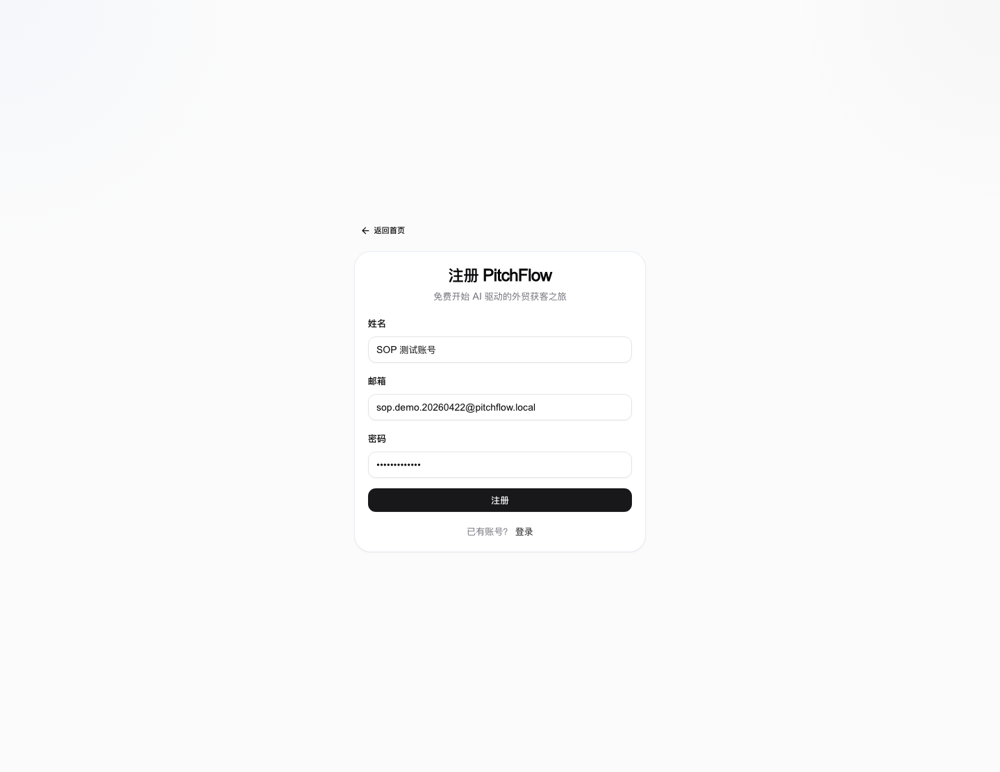
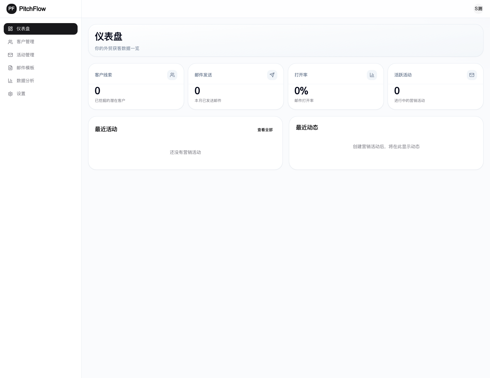
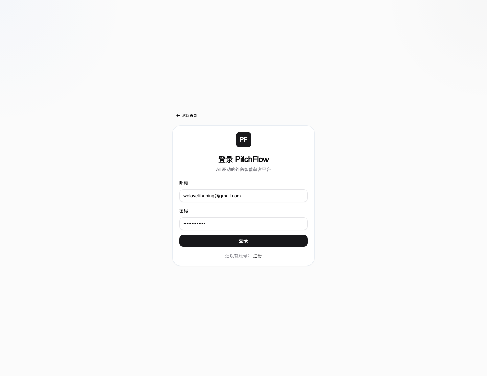
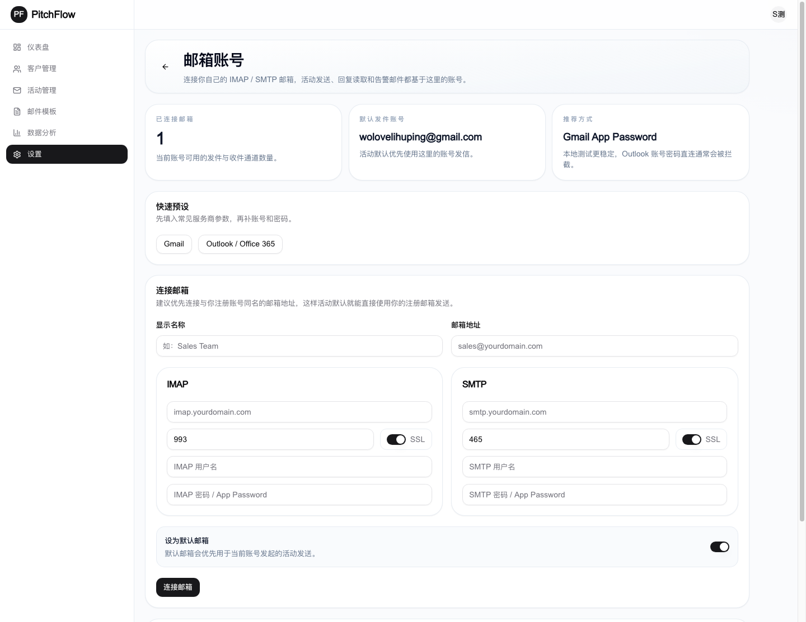
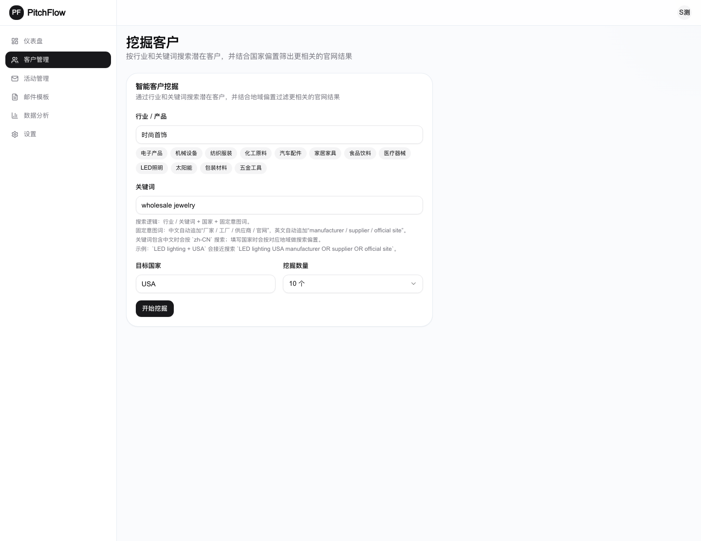
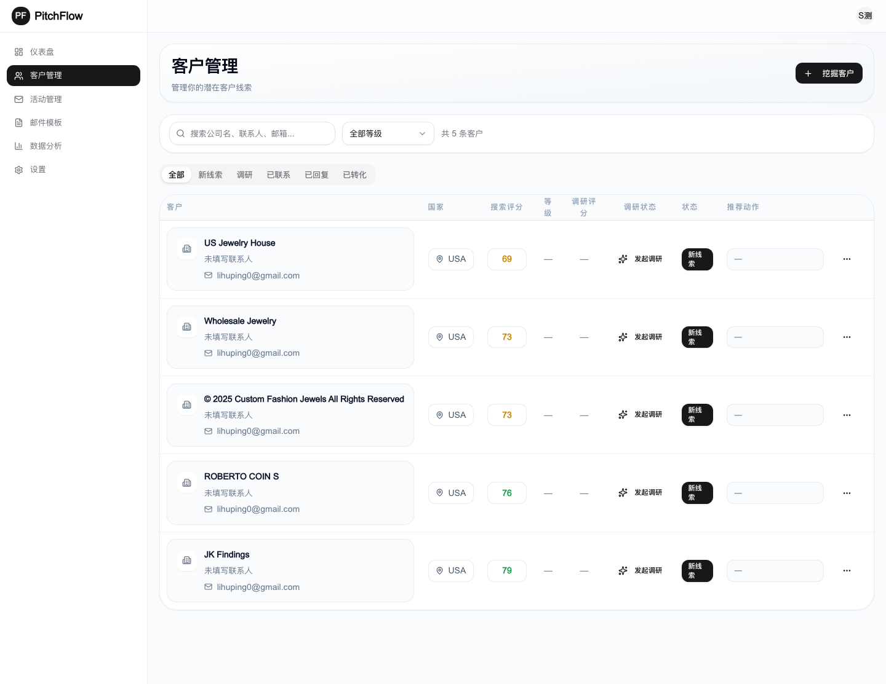
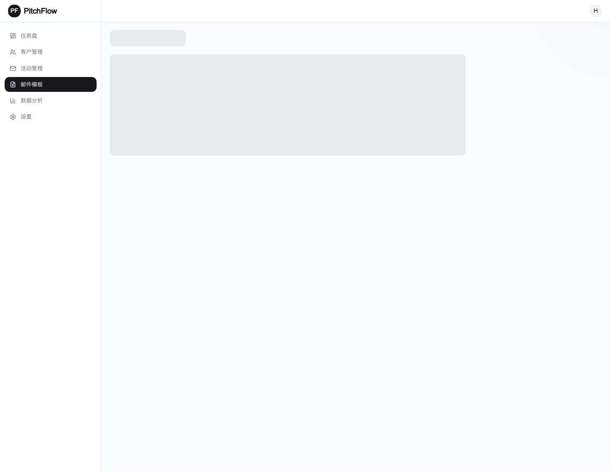
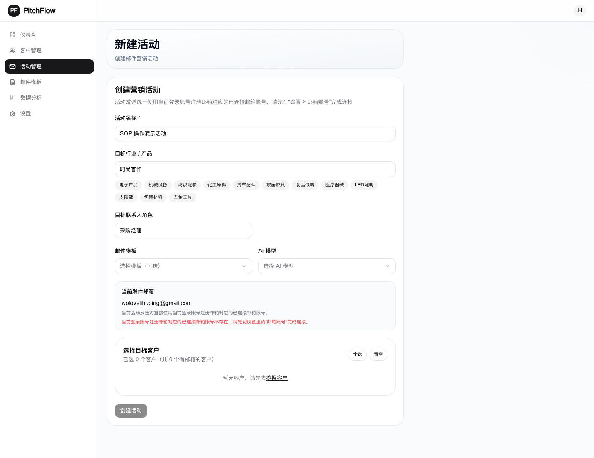
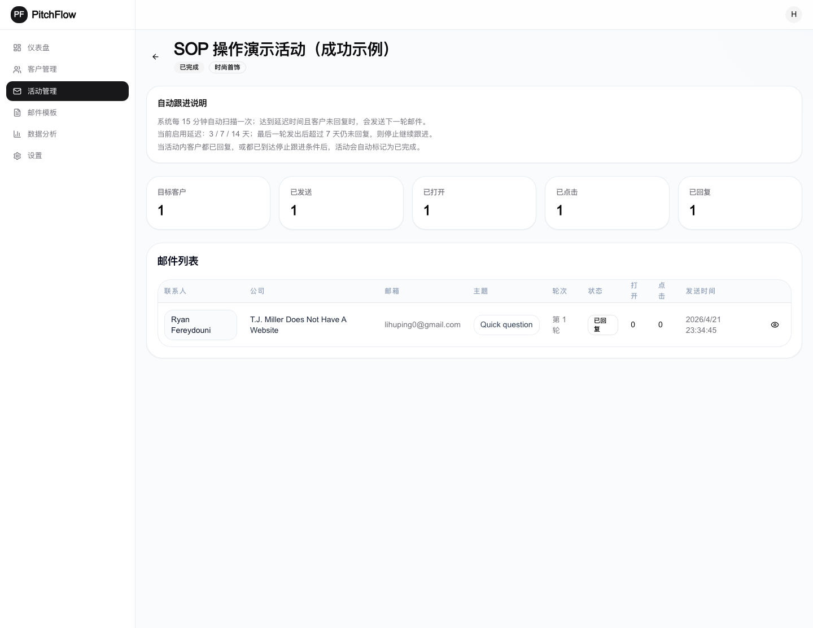

# PitchFlow 用户 SOP 操作手册

更新时间：2026-04-22  
适用范围：PitchFlow Web 前台用户从注册到活动详情查看的完整操作流程

## 一、使用目标

这份手册覆盖以下核心链路：

1. 用户注册
2. 登录系统
3. 绑定邮箱账号
4. 挖掘潜在客户
5. 查看客户列表
6. 配置邮件模板
7. 新建营销活动
8. 查看活动详情与发送结果

## 二、前置准备

正式开始前，请先确认：

1. 当前登录账号已经有可用的注册邮箱
2. 该注册邮箱已经在 `设置 > 邮箱账号` 里完成连接
3. AI 模型和 EmailEngine 已在系统后台配置完成
4. 测试发送时请使用测试邮箱，避免误发真实客户

## 三、操作步骤

### 1. 注册新账号

进入注册页，填写姓名、邮箱和密码后提交。

操作说明：

1. 打开 `/register`
2. 输入姓名
3. 输入邮箱
4. 输入至少 8 位密码
5. 点击 `注册`

---

### 2. 注册成功后进入仪表盘

注册成功后，系统会自动登录并进入仪表盘首页。

操作说明：

1. 提交注册表单后等待页面跳转
2. 确认已经进入 `/dashboard`
3. 后续客户、模板、活动都会基于当前团队数据操作

---

### 3. 使用账号登录

如果需要重新进入系统，可在登录页使用邮箱密码登录。

操作说明：

1. 打开 `/login`
2. 输入注册邮箱
3. 输入密码
4. 点击 `登录`

---

### 4. 绑定邮箱账号

进入 `设置 > 邮箱账号`，连接与你注册邮箱一致的邮箱账号。活动发信、回复读取和消息追踪都会依赖这里的邮箱。

操作说明：

1. 打开 `/settings/mailboxes`
2. 选择常见服务商预设，例如 Gmail
3. 填写邮箱地址、IMAP 和 SMTP 参数
4. 点击 `连接邮箱`
5. 连接成功后，确认邮箱状态为可用

说明：

1. 当前活动发送默认取 `当前登录账号注册邮箱对应的已连接邮箱账号`
2. 如果这里没有连接成功，后续活动发送无法继续

---

### 5. 挖掘潜在客户

进入客户挖掘页，按行业、关键词和国家进行搜索。

操作说明：

1. 打开 `/prospects/new`
2. 输入行业 / 产品
3. 输入关键词
4. 选择目标国家
5. 选择挖掘数量
6. 点击 `开始挖掘`

建议：

1. 行业尽量具体，例如 `时尚首饰`
2. 关键词尽量贴近采购意图，例如 `wholesale jewelry`
3. 国家建议明确填写，避免结果过泛

---

### 6. 查看客户列表

挖掘完成后返回客户列表页，可以看到客户基础信息、搜索评分、调研评分和推荐动作。

操作说明：

1. 打开 `/prospects`
2. 查看客户名称、邮箱、国家和评分
3. 点击客户卡片可直接进入客户详情页
4. 后续活动创建时，可以直接从这里筛选可用客户

---

### 7. 配置邮件模板

进入模板编辑页，配置主题、正文、产品名称和发件人名称。

操作说明：

1. 打开 `/templates/new`
2. 填写模板名称
3. 填写邮件主题
4. 填写邮件正文
5. 通过变量引用客户信息，例如：
   - `{{contactName}}`
   - `{{companyName}}`
   - `{{industry}}`
   - `{{productName}}`
   - `{{senderName}}`
6. 保存模板

建议：

1. 主题尽量自然，不要过度营销化
2. 正文控制在较短篇幅，优先突出价值点和回复动作
3. 模板里保留变量，方便后续批量生成个性化邮件

---

### 8. 新建营销活动

进入活动新建页，填写活动名称、行业、联系人角色，并勾选目标客户。

操作说明：

1. 打开 `/campaigns/new`
2. 填写活动名称
3. 填写目标行业 / 产品
4. 填写目标联系人角色
5. 选择目标客户
6. 点击 `创建活动`

说明：

1. 活动发送默认使用当前登录账号注册邮箱对应的已连接邮箱账号
2. 客户列表支持按评分和关键词筛选后再勾选

---

### 9. 查看活动详情

活动创建并启动后，可在活动详情页查看目标客户、已发送状态、回复情况和邮件明细。

操作说明：

1. 打开对应活动详情页
2. 查看顶部统计：
   - 目标客户
   - 已发送
   - 已打开
   - 已点击
   - 已回复
3. 查看下方邮件列表
4. 如邮件发送失败，可对单封邮件执行重新同步

说明：

1. 系统会定时扫描自动跟进条件
2. 客户回复后，活动状态和消息追踪会继续更新

## 四、发布前检查清单

正式发布到线上前，建议逐项确认：

1. 邮箱连接链路可用
2. 活动发信能成功进入已发送状态
3. 客户回复后能回写到活动详情
4. 消息追踪邮件、飞书、企微通知内容完整
5. 客户列表、活动列表分页正常
6. 前台登录注册页面只保留邮箱密码入口
7. AI 模板生成结果不再出现 `think` 内容

## 五、文档说明

这份手册中的截图来自本地真实测试环境，不是示意图。  
如果后续要对外发给运营、销售或客服团队，建议再补一版线上环境截图，并转成 PDF 或 DOCX 归档。
